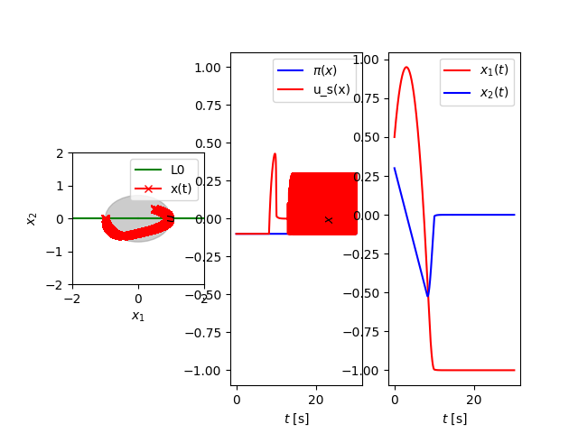
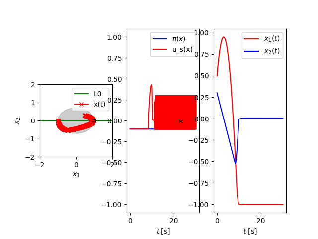
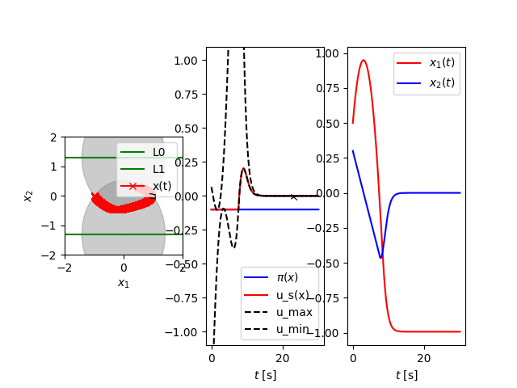

# multi-cbf

This repository contains the scripts required to reproduce the simulation results in our paper ["Preventing Unconstrained CBF Safety Filters Caused by Invalid Relative Degree Assumptions."](https://arxiv.org/abs/2409.11171)

## Use
This was tested on Ubuntu 20.04. 

#### Setting up
Create a data directory. You can modify the data directory by updating the entry `"data_dir"` in `configs/config.json`.

```sh
cd
mkdir multi-cbf-sim
```

Clone this repository. 

```sh
git clone https://github.com/lukasbrunke/multi-cbf.git
cd multi-cbf/
```

Create conda environment:

```sh
conda env create -f environment.yml
```

Create a new [wandb.ai](wandb.ai) project and modify the name of the project by setting `"wandb_project"` to the name of your project in `configs/config.json`. If you don't want to use [wandb.ai](wandb.ai), you can deactivate it by setting `"wandb_project": ""`.   

#### Run
Run the `main.py` script:

```sh
python3 main.py --config configs/config_multi_100hz.json
```

Choose the appropriate config file for generating the desired result from the paper, for example, use the config file `config_multi_100hz.json` to use the multi-CBF safety filter running at 100 Hz. 

#### Safe Set Tightening
To tighten the safe set, the same config has to be run twice. For the first run, the entry `"run_name"` should be `null`. For the second run, the entry `"run_name"` should be set to the appropriate [wandb.ai](wandb.ai) run name. As stated in the paper, this only applies to the config file `config_multi_10000hz.json`. 

#### Visualization
The results can be visualized using the plotting script. Modify the config to either specify the `run_name` (from [wandb.ai](wandb.ai)), the `file_name` (where the results are stored), or `use_latest` as true to plot and save the results from the latest run. 

```sh
python3 plot_data.py --config configs/config_plot.json
```
For convenience, the plots are also saved as `.tex` and `.png` files. 

## Output

The different configs generate the following figures:

Single-CBF safety filter at 10 kHz:



Single-CBF safety filter at 100 Hz:



Multi-CBF safety filter at 10 kHz:



Multi-CBF safety filter at 10 kHz with safe set tightening:


Multi-CBF safety filter at 100 Hz:


## Citation

Please cite our work as:

```bibtex
@misc{multicbf2024,
      title={Preventing Unconstrained CBF Safety Filters Caused by Invalid Relative Degree Assumptions}, 
      author={Lukas Brunke and Siqi Zhou and Angela P. Schoellig},
      year={2024},
      eprint={2409.11171},
      archivePrefix={arXiv},
      primaryClass={eess.SY},
      url={https://arxiv.org/abs/2409.11171}, 
}
```

-----
>  [Learning Systems and Robotics Lab](https://www.learnsyslab.org/) at the Technical University of Munich (TUM) and the University of Toronto
